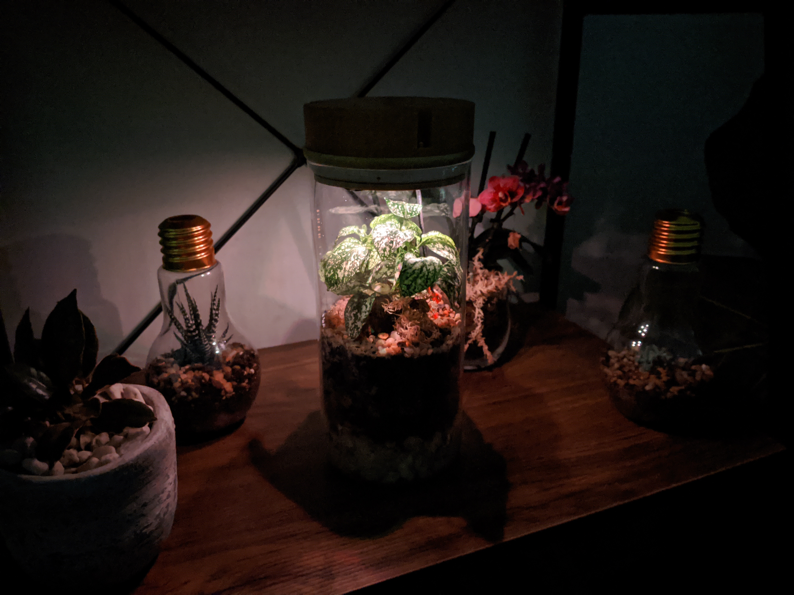

# IoT-Terrarium



## Getting started

This is the GitHub repo to support my Instructable. Be sure to head over there to [see how to build it](https://www.instructables.com/id/IoT-Terrarium/)!

#### Installing the Arduino IDE

This project was written in the Arduino environment. If you do not have it you will need to [download it from here](https://www.arduino.cc/en/main/software) to be able to open and compile any of the files in this repo.

#### Installing the ESP8266 Core

Since this project uses the ESP8266 as the microcontroller, the board needs to be installed into the Arduino environment. This can be done by following the steps over at [the GitHub repo for the ESP8266](https://github.com/esp8266/Arduino).

#### Installing Libraries

The code to run the lights was built to be as simple as possible for users to set up their device and get it up and running. This comes at the expense of the code being a little more complex to get some of the features I wanted. To speed up development I used a couple of absolutely amazing additional libraries which include;
- [ArduinoJson](https://arduinojson.org/) for messaging in JSON.
- [ESPAsyncTCP](https://github.com/me-no-dev/ESPAsyncTCP)] for the base layer of the WebSocket's
- [ESPAsyncUDP](https://github.com/me-no-dev/ESPAsyncUDP) for collecting the time from an NTP via UDP
- [FastLED](https://github.com/FastLED/FastLED) for controlling the LED's
- [Timelib](https://github.com/PaulStoffregen/Time) for keeping track of the current time
- [WebSockets](https://github.com/Links2004/arduinoWebSockets) for creating a server for sending messages to and from clients
- [DHT11-library](https://github.com/adafruit/DHT-sensor-library) for reading sensor data from the DHT sensors

These additional libraries need to be installed, of which some are available in the Arduino IDE and some not. Due to this I have included the current working versions of the libraries in .Zip format to be able to import into the Arduino IDE. If you need to install these libraries, clone this repo and install the .zip files in the External Library folder using [the method from Arduino](https://www.arduino.cc/en/guide/libraries).

## Features

The code comes with several features built in to make things easier to manage. This includes things like having all the global variables in the main sketch file to "over the air updates".

#### OTA

You may update the sketch on the ESP to a new firmware using the inbuilt webhook on `http://your-esp-ip-address/update` or `http://IoT-Terrarium.local/update` if you kept the default name. You must upload a binary file, uploading a sketch in .ino form will not work. For more info see [here](https://arduino-esp8266.readthedocs.io/en/latest/ota_updates/readme.html#web-browser).

## Website Features


This project comes with its own inbuilt website built in Bootstrap 4 to read the sensor data and control the LED. The website is accessible either via your home network if connected, or the ESP's wireless access point. If you connect your ESP8266 through your home Wi-Fi network, this will be available at the IP address of the device, or at the mDNS name which defaults to http://IoT-Terrarium.local/update

If you are connected to the ESP8266 via its access point, the webpage should be sent via a captive DNS. This is automatic on Windows and Apple products, but will require clicking "sign into network" on Android phones. It should be noted that mDNS does not work in this mode, and the default IP address is http://192.168.4.1. Please visit [this link](https://arduinojson.org/) first to cache the important files in your browser first.

## Messaging Specification

The webserver code is listening for incoming WebSocket messages with a JSON payload. This is processed after the message is received out of the callback. The complete example of the message is as follows. By connecting to the WebSocket server at port 81 from an external application such as Node-RED, allows users to talk to the device.

#### Control Messages

```
{
    "State": true,              // Needs to be boolean
    "Colour": {
      "Red": 0,                 // Values will be constrained to between 0 and 255
      "Green": 0,               // Values will be constrained to between 0 and 255
      "Blue": 0                 // Values will be constrained to between 0 and 255
    }
  }
```

#### Data Messages

```
{
    "State": true,              // The state of the LED
    "Colour": {
      "Red": 0,                 // Values will be constrained to between 0 and 255
      "Green": 0,               // Values will be constrained to between 0 and 255
      "Blue": 0                 // Values will be constrained to between 0 and 255
    }
    "Temperature" : [           // Array of chosen size
        {
            "x" : 1575180261,	// Unix timestamp
            "y" : 24			// Data point for temperature
        }
        ...
    ],
    "Humidity" : [              // Array of chosen size
        {
            "x" : 1575180261,	// Unix timestamp
            "y" : 50			// Data point for humidity
        }
        ...
    ],
    "Moisture" : [              // Array of chosen size
        {
            "x" : 1575180261,	// Unix timestamp
            "y" : 100			// Data point for soil moisture
        }
        ...
    ]
  }
```

## Contributing
If you would like to edit or use this project elsewhere you are more than welcome, I just ask that you let me know if you can, I'd love to see how the project is used and adapted. Changes and additions to Modes, the website, or documentation here on GitHub are also welcome. I only ask that you follow the basic contributing guide and make a pull request so I can both read and test your changes before implementing.